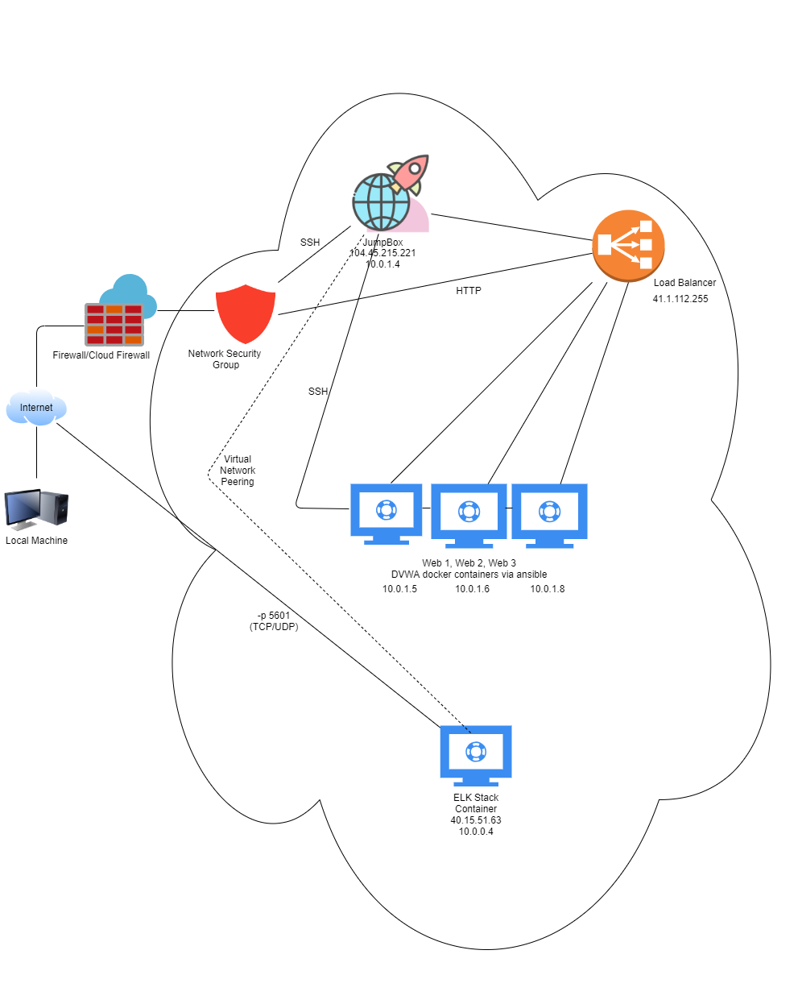

## Automated ELK Stack Deployment

The files in this repository were used to configure the network depicted below.

These files have been tested and used to generate a live ELK deployment on Azure. They can be used to either recreate the entire deployment pictured above. Alternatively, select portions of the _____ file may be used to install only certain pieces of it, such as Filebeat.

  - _TODO: Enter the playbook file._
  Ansible Playbook (ansible_config.yml)

This document contains the following details:
- Description of the Topology
- Access Policies
- ELK Configuration
  - Beats in Use
  - Machines Being Monitored
- How to Use the Ansible Build

### Description of the Topology

The main purpose of this network is to expose a load-balanced and monitored instance of DVWA, the D*mn Vulnerable Web Application.

Load balancing ensures that the application will be highly _____, in addition to restricting _____ to the network.
- Security aspects that load balancers protect are that they prevent DDoS attacks while securing availability. The advantange of a jump box is that they improve a company's network by providing restricted access to your network environment where there a specific and secure main location that needs have a connection with first in order to launch tasks properly.   

Integrating an ELK server allows users to easily monitor the vulnerable VMs for changes to the _____ and system _____.
- -Filebeat watches for log files and collects log events, forwarding them to Elasticsearch or Logstash to be indexed.
- Metricbeat watches for metrics and statistics from the OS and server.

The configuration details of each machine may be found below.
_Note: Use the [Markdown Table Generator](http://www.tablesgenerator.com/markdown_tables) to add/remove values from the table_.

| Name     | Function | IP Address | Operating System |
|----------|----------|------------|------------------|
| Jump Box | Gateway  | 10.0.1.4   | Linux            |
| Web_1    | Webserver| 10.0.1.5   | Linux            |
| Web_2    | Webserver| 10.0.1.6   | Linux            |
| Web_3    | Webserver| 10.0.1.8   | Linux            |
| ELK_VM   | ELKserver| 10.0.0.4   | Linux            |

### Access Policies

The machines on the internal network are not exposed to the public Internet. 

Only the jump box machine can accept connections from the Internet. Access to this machine is only allowed from the following IP addresses: 104.45.215.221

Machines within the network can only be accessed by jump box. Its IP address is 10.0.1.4.

A summary of the access policies in place can be found in the table below.

| Name     | Publicly Accessible | Allowed IP Addresses |
|----------|---------------------|----------------------|
| Jump Box | Yes                 | 104.45.215.221       |
| ElkServer| Yes                 | 104.45.215.221       |
| Webs1    | No                  | 10.0.1.4             |
| Webs2    | No                  | 10.0.1.4             |
| Webs3    | No                  | 10.0.1.4             |
### Elk Configuration

Ansible was used to automate configuration of the ELK machine. No configuration was performed manually, which is advantageous because it establishes the script to run uniformly with the same steps and measures every time they run on each machine.
- The main advantage of automating configuration with Ansible is that this assists in fixing the lack of consistency between configurations, as well as limiting mistakes.

The playbook implements the following tasks:
- Install Docker
- Create and link container
- Install Python-pip
- Install Docker python module
- Arrange Filebeat configuration file
- Increase virtual memory
- Authenticate installation & playbook 
- Download & launch Docker ELK container with ports 5601, 9200, 5044 

The following screenshot displays the result of running `docker ps` after successfully configuring the ELK instance.

### Target Machines & Beats
This ELK server is configured to monitor the following machines:
- Web_1 10.0.1.5
- Web_2 10.0.1.6
- Web_3 10.0.1.8

We have installed the following Beats on these machines:
- Filebeat
- Metricbeat

These Beats allow us to collect the following information from each machine:
- Filebeat generates & organizes log files to send to Elasticsearch on the ELK server. The logs consist information about the file system such as when & which files have altered.
- Metricbeat records metrics and statistics from an OS and services of servers. The logs consist information such as memory, CPU usage, and disk & network input/output statistics. 

### Using the Playbook
In order to use the playbook, you will need to have an Ansible control node already configured. Assuming you have such a control node provisioned: 

SSH into the control node and follow the steps below:
- Copy the install-elk.yml file to /etc/ansible/files.
- Update the hosts file to include the ELK server IP addresses.
- Run the playbook, and navigate to the the ELK server GUI to check that the installation worked as expected.

_TODO: Answer the following questions to fill in the blanks:_
- _Which file is the playbook? Where do you copy it?_ install-elk.yml; /etc/ansible/install-elk.yml (copy it to the directory)
- _Which file do you update to make Ansible run the playbook on a specific machine? How do I specify which machine to install the ELK server on versus which to install Filebeat on?_ Update the hosts file; Include the private IPs under "webservers" in the file to specify which host group a certain system belongs to.
- _Which URL do you navigate to in order to check that the ELK server is running? http://40.15.51.63:5601/

